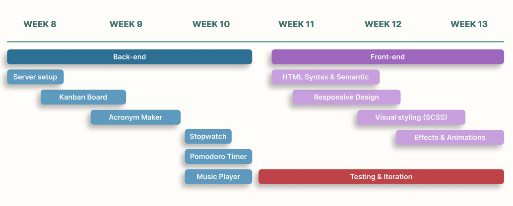
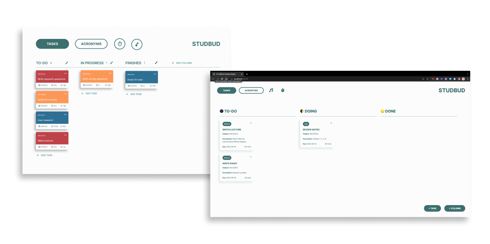
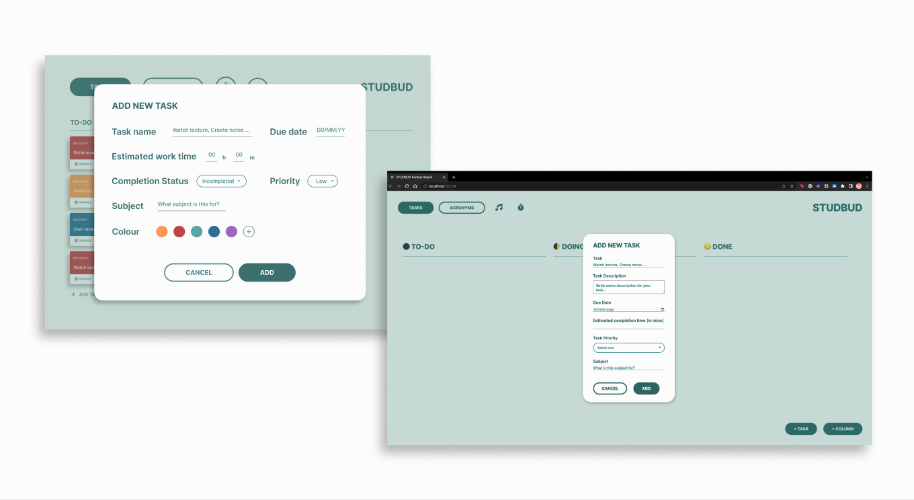
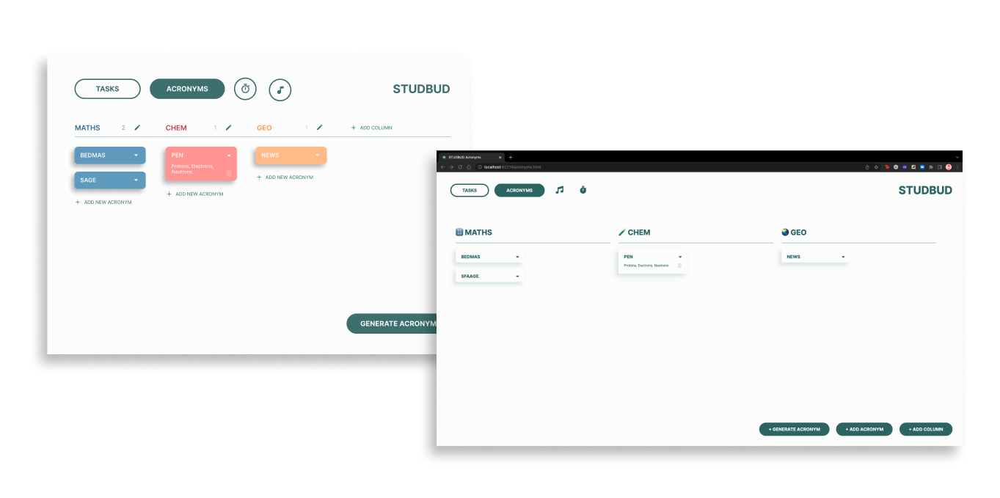
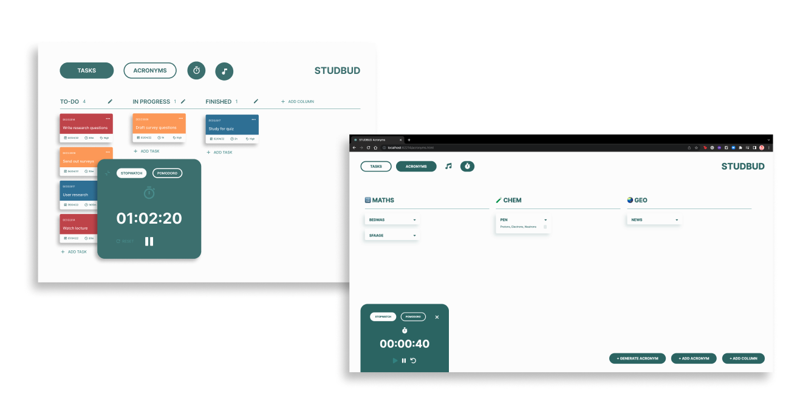
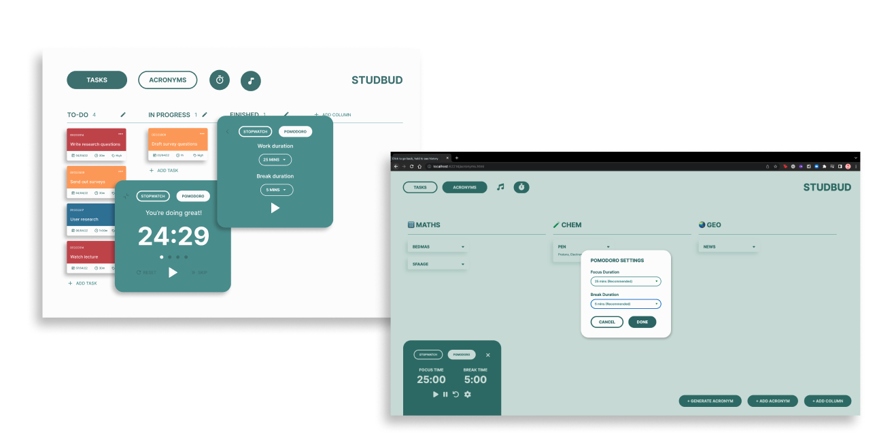
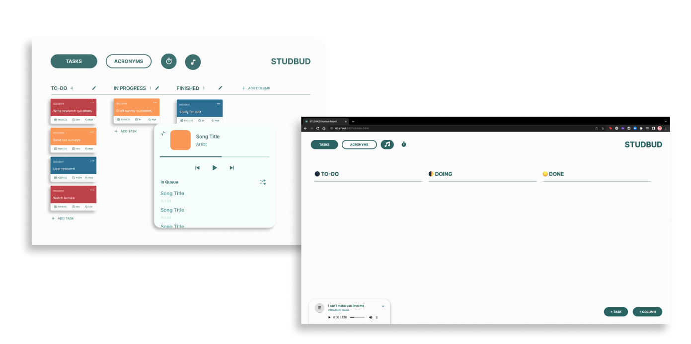

# STUDBUD
##### Created by Samantha Le (hole7771)
 This is a documentation of how STUDBUD, a website application that is designed for university students with ADHD to help them manage their study sessions efficiently, went through many phases of transformation and iteration from the proposed mockups to the current web app prototype. 

## 📈 Development Roadmap
As a requirement of the last assignment, a development roadmap was created in order to track and make sure that all milestones are achieved in an efficient and timely manner.



Thus, following the roadmap, the server for the web app was first set up. However, I soon realised that back and front-end went hand in hand with each other, rather than two separate timeframe as demonstrated in the roadmap. This means that as the back-end was developing, the front-end was also in the process, in order to ensure that the feature worked and looked as planned. 

Therefore, the roadmap development was revised, starting from the primary features, the Kanban Board and Acronym Maker, to the secondary ones, the Stopwatch, Pomodoro Timer and Music Player. Each feature was followed by the front-end design and user testing.

## ⚙️ Features
Since I have done DECO1016 last semester, I was a bit more familiar with HTML and CSS. However, this is my first time developing a website application using JavaScript. As expected, there was are a big learning curve for me to overcome. However, after many hours dedicated to develop and iterate the web app with an enjoyable user experience and an intuitive user interface in mind, here are the list of features of the final prototype of STUDBUD.

### 📝 Kanban Board  
It was challenging to follow activities to create a function task list during tutorials as I was still trying to familiarise myself with JavaScript. However, I had dedicated time outside of class to work on it at my own pace. Forking Rob's [Modular Web App Demo](https://replit.com/@robdongas/Modular-WebApp-Demo) (2022), I allowed myself quite a bit of time to work backwards and get to know how each object, array and function does thoroughly first in order to utilise them for my own work. 

After understanding how to create and display dynamic HTML content in JavaScript using Document Object Model (DOM) methods, I used them as the backbone of my own task list while adding my own styling as proposed for the mockup.



Styling of the Kanban Board was simplified. With priority ranking tags, big bold task title, and clearly laid out task information with description (rather than icons), users were able to easily view their tasks on the Kanban Board without being distracted with different colours. Buttons to add new tasks and columns were also moved be next to each other in the bottom left corner. This change was made as users found them to be more accessible.

Instead of having another Edit Task Modal pops up as proposed, users could directly edit the task content as well as the column titles on the webpage as each element is attached with ```contenteditable```. This makes it easier for users to make changes and edit if they accidentally made a mistake. In addition, users could also drag and drop task cards between the column based on their progress with the task. This is made possible by utilising and adapting [WebDevSimplified's](https://codepen.io/WebDevSimplified/pen/JjdveeV) Drag and Drop code (n.d.).



The layout of the task form was changed. After revising, the form now takes up less space yet still remains to be the focal point of the page due to the light green overlay on top of the rest of the page content. According to [Andrew Coyle](https://medium.com/nextux/form-design-best-practices-9525c321d759) (2020), forms should be in one column as they are "more comfortable to scan and conform better to mobile displays." With the form elements aligned neatly and evenly in the centre, users found that it's quicker for them to scan the elements and fill in the information accurately.  Moreover, a new task description input field is added as users pointed out that only the task title was not sufficient enough for them to describe the task accurately.

### 🪄 Acronym Maker
Similar to the Kanban Board, styling of the Acronym Page was also revisited with a more minimal look. This ensures the consistency is maintained throughout the web app. Users are able to expand the acronym card, which reveals the defition of the acronymised word. This allows the user to only see the acronym which they can then test themselves. Users are also provided both options to either add their own acronym and its definition or let the web app generate the acronym for them based on their input, in which all acronyms are passed into the same board. Again, all elements are attached with ```contenteditable``` so that the user can easily edit the content without any extra steps.



For this page, similar codes with the Kanban Board were used with minor changes to suit the webpage functionality. This does not only help ease the process of developing this webpage but also ensure consistency of the web app. However, I also faced a challenge when I was trying to work out how to get the user's input, pass it to the function in order to generate an acronym and display the dynamic content on the webpage. I then took some time of to work on other features of the app instead of dwelling on the issue for so long. I found this to be extremely helpful as I immediately realised the answer was right in front of me once I had revisited the problem.

### ⏱ Stopwatch
Based on user feedback, there was not enough contrasts for some of the icons. The small sizes of the icons also made it difficult to recognise and select. Thus, the styling of icons were revised to ensure accessibility and readibility which are the key standards that need to be kept in mind when designing a website based on W3C's [Accessiblity Guidelines](https://www.w3.org/WAI/standards-guidelines/) (2022)



The stopwatch is attached the bottom instead of moving freely around the page as proposed initially. However, users still have the freedom to move the stopwatch along the x-axis by using code adapted from W3Schools (n.d.). 

### 🔔 Pomodoro Timer
As seen in the stopwatch modal, the Pomodoro Timer can be toggled on as well. By using the same form styling as seen throughout the web app, the Pomodoro Settings could be modified based on user's input rather than having two similar modal appearing as this confused the users. Likewise, icons for the Pomodoro Timer were also revisited to ensure accessibility and readibility.



Adapted from [Sam Kautz's](https://github.com/Web-Dev-Jr/JS-Pomodoro) code for Pomodoro App (2021), the Pomodoro Timer counts down the duration of the current session. As soon as the user finishes one Pomodoro period, a bell sound would be played. Therefore, even though the user may close the Pomodoro Timer, the timer still continues to play and the user will be notified by the bell which signifies the end of the session.

### 🎵 Music Player
Althought I had attempted to adapt [Brad Traversy's](https://github.com/bradtraversy/vanillawebprojects/tree/master/music-player) code (2021) for the Music Player, I was unsuccessful to do so as I could not pinpoint the exact problem why songs stored in the music folder were not played.



Therefore, I have resorted to using the default audio controls with a bit of styling. As of the moment, users are equipped with 3 songs which could be accessed by scrolling down in the Music Player modal. This could be improved upon by having a Previous and Next button as it would be more intuitive. It is acknowledged that this might not be the ideal solution for the music player. However, knowing that I had tried my best to figure out the issues, it was more essential for me at the time to have a functional music player than to have none at all.

## 🌱 Key Takeaways
### 💪🏼 No Pain No Gain
As this was my first time producing a web app prototype using JavaScript, I had faced many challenges getting familiarised with the foreign concept. To overcame this learning curve, I reached out to tutors for help as well as dedicated a lot of hours for self-learning and practicing. This project had definitely equipped me with basic JavaScript knowledge that would be extremely useful in the future. 

### ⏳ Time Management is Key
From mapping out what an ideal development roadmap to be to actually working on the project helped me realise the importance of time management. At times, I had failed to management my time effectively as I often got hung up on an issue for a long time. However, I had learned that taking a step back and coming back to the issue with a clear mind would sometimes solve the problem. 

## 📚 References
Coyle, A. (2020). *Form design best practices.* NextUX. https://medium.com/nextux/form-design-best-practices-9525c321d759

### ✨ Code

Dongas, R. (2022). Modular-WebApp-Demo [Source Code]. Replit. https://replit.com/@robdongas/Modular-WebApp-Demo

Kautsz, S. (2021). JS-Pomdoro [Source Code]. Github. https://github.com/Web-Dev-Jr/JS-Pomodoro

Traversy, B. (2021). music-player [Source Code]. Github. https://github.com/bradtraversy/vanillawebprojects/tree/master/music-player

WebDevSimplified. (n.d.). Drag and Drop [Source Code]. Codepen. https://codepen.io/WebDevSimplified/pen/JjdveeV

Wetton, K. (2019). Dynamic Colour Picking - Part 3 [Source Code]. Codepen. https://codepen.io/kylewetton/pen/bGbobMa?editors=1111

W3C. (2022). *W3C Accessibility Standards Overview.* https://www.w3.org/WAI/standards-guidelines/

W3Schools. (n.d.). How TO - Create a Draggable HTML Element [Source Code]. W3Schools. https://www.w3schools.com/howto/howto_js_draggable.asp

### ✨ Audio, Images
KINDA BLUE (킨다블루). (@kindablue.kr). (2021). [Image Post]. Instagram. https://www.instagram.com/p/CR3XfmfL-pn/

lili. (2019). *d.o. // that's okay 괜찮아도 괜찮아 lyrics* [Video]. Youtube. https://www.youtube.com/watch?v=mNOPS61i8Fo

Longshow. (2018). *Tom Misch - Movie* [Video]. Youtube. https://www.youtube.com/watch?v=hwKZxdhu95E

1theK (원더케이). (2021). *[MV] KINDA BLUE,HWA SA(킨다블루,화사) _ I can’t make you love me* [Video]. Youtube. https://www.youtube.com/watch?v=SzP6xOIp2U4

Wikipedia. (2022). Geography (Tom Misch album) [Image]. Wikipedia. https://upload.wikimedia.org/wikipedia/en/1/14/Tom_Misch_%E2%80%93_Geography.png

Wikipedia. (2021). That's Okay [Image]. Wikipedia. https://en.wikipedia.org/wiki/That%27s_Okay#/media/File:That's_okay_Cover.jpg

#### 👉🏼 All audio was converted from Youtube video to mp3 using https://y2mate.tools/en568c
#### 👉🏼 All icons are from Font Awesome v6
